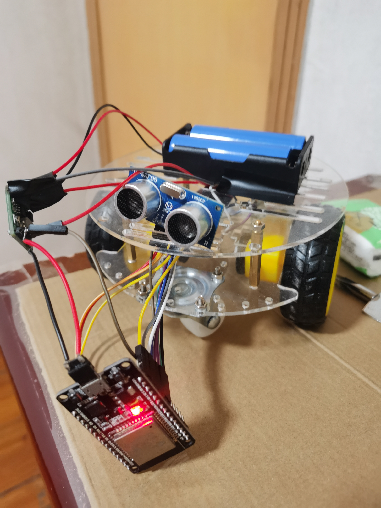
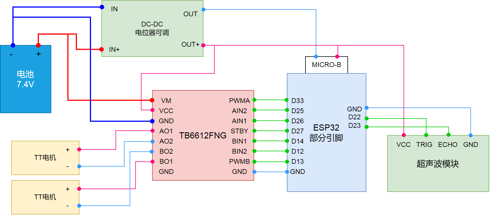

# Leo Car
- 这是一个**树莓派智能小车**的项目，树莓派安装摄像头，通过**mjpg-streamer**向局域网上传网络视频流。在同局域网的PC或者树莓派本身运行python flask服务，即可使用手机（同局域网）通过服务器上的web应用访问视频流，并通过交互组件操控小车进行转向。
- 还实现了树莓派搭载**人脸检测算法**并控制小车旋转对人脸进行追踪，由于链路已经打通，用户可以自行设计将PC作为云算力增强其功能。
- 硬件：树莓派3B+，摄像头（任意），亚克力小车（双轮），TT电机，电机驱动TB6612，锂电池。
- ESP32版小车：同时附有**ESP32**实现小车控制的工程，里面含有TB6612FNG控制，超声波避障，BLE远程控制等功能。
- 参考项目：https://github.com/rossning92/rpi-robot。

  
## 项目结构
- 注：网络视频流指**树莓派上的摄像头通过mjpg-streamer上传到局域网的网络视频流**

| 文件名 | 功能 | 运行设备 |
| :---: | :---: | :---: |
| device.py| 树莓派引脚控制电机的类及测试程序 | 树莓派 |
| webcam_car_facefollow.py| 读取网络视频流，进行人脸检测，并控制小车转向追踪人脸 | 树莓派 |
| webcam_facedetetion.py| 读取视频流，并进行人脸检测 | 树莓派/PC |
| web_control.py| h5页面 通过局域网和 PC/树莓派 上的python flask服务器交互，控制组件发送数据到服务器 | 树莓派/PC |
| web_control_car.py| 在web_control.py基础上可以控制小车旋转 | 树莓派 |
| webcam.sh| 树莓派上运行mjpg-streamer，开启网络视频流的脚本 | 树莓派 |
| webcam_extra.sh| 在webcam.sh基础上，可通过其官网访问视频流 | 树莓派 |
| webcam_video.py| 读取视频流并显示 | 树莓派/PC |
| static | python flask服务器上的web应用，可访问视频流，通过交互组件进行小车的角度控制信息的传输 | 树莓派/PC |
| Motor_Control_ESP32 | 利用ESP32实现控制小车，可通过低功耗蓝牙BLE远程控制小车 | ESP32 |
| record | 过程记录和总结 | |

## 接线图
- 树莓派版：

- ESP32版：

